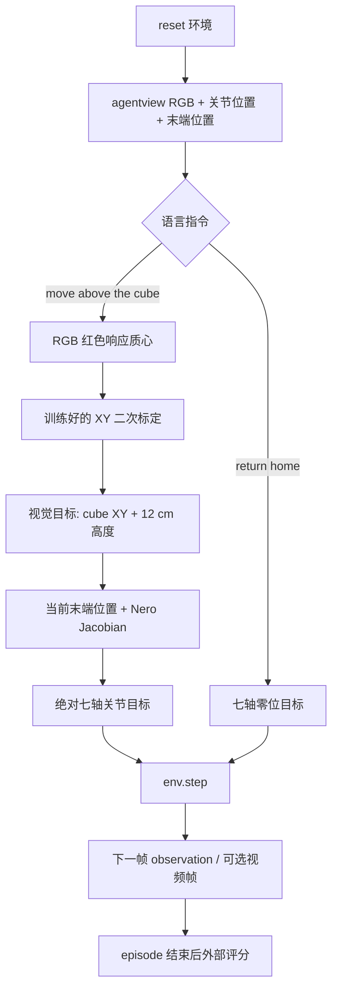

# Nero + DH116 VLA 技术总文档

## 0. 结论先行

当前 VLA 阶段已经完成了一个可审计、可复现的“小型视觉-语言-动作”闭环：

- `move above the cube`：只用普通 RGB 和机器人本体状态，把机械臂移动到随机方块初始位置上方 12 cm；
- `return home`：把 Nero 七轴返回零位；
- 正常 RGB 留出评测：到达 6/6、回家 6/6；
- 同一种子、同一初始目标的全黑 RGB 反事实：到达 0/6；
- 视觉定位验证集平均误差 2.06 mm、最大误差 3.00 mm；
- 已保存 6 个编号视频，每个 181 帧、20 fps，并有独立 manifest；
- 纯物理 Lift 抓取仍未完成：接触发生在第 500 步，但方块高度增益为 0。因此本文件不把“到达方块上方”描述成“抓取成功”。

这是一个用于验证数据边界、视觉依赖和动作闭环的模块化基线，不是大规模预训练 VLA 模型。

## 1. 为什么先做这个任务

之前的 Nero + DH116 Lift 实验在关闭接触稳定器的情况下没有真正抬起方块。若直接把稳定器制造的轨迹当作成功抓取数据，会把物理失败隐藏在训练数据里。因此当前阶段先把问题拆成两个物理含义清楚、容易评分的指令：

1. 视觉找到方块，并将末端移动到方块上方；
2. 执行语言条件下的回零动作。

这样可以先验证“图像 + 语言 + 本体状态 → 动作 → `env.step()` → 外部评分”是否真正连通，再决定是否进入接触和抓取阶段。

## 2. 系统边界与反作弊规则

| 部分 | 允许使用 | 明确禁止 |
|---|---|---|
| 策略输入 | `agentview_image`、`robot0_joint_pos`、`robot0_eef_pos`、语言指令选择 | `cube_pos`、物体状态、分割图、geom/body id |
| 训练监督 | 专家动作；`cube_xy_labels` 只作为视觉定位监督 | 把方块真值塞进推理输入 |
| 评测评分 | reset 后保存的方块初始位置，仅用于结束后的外部误差计算 | 用真值持续纠偏策略 |
| 动作执行 | Nero 原生绝对关节目标，通过 `env.step()` 执行 | 直接改方块/机器人 qpos、qvel 或接触状态 |
| 物理机制 | 普通 MuJoCo 控制器与 Jacobian | `ContactGraspStabilizer`、焊接约束、失败后切专家 |
| 数据划分 | 按 episode 划分训练和验证 | 把同一轨迹相邻帧拆到两侧 |

环境固定为 `use_object_obs=False`。脚本会在 reset 后检查 observation key，一旦出现包含 `cube` 或 `object` 的键就中止。

## 3. 端到端设计

采集阶段的专家可以读取仿真方块坐标来产生标签和动作；部署阶段的 `RidgeVLAPolicy` 不读取该坐标。视觉部分不是通用图像编码器，而是一个可解释的 RGB 定位器：对红色响应做加权质心，使用训练集拟合的二次校准映射到方块 XY。

动作部分使用当前末端位置、本体关节位置和机器人自身 Jacobian。视觉定位结果在一个 episode 的 `move above the cube` 指令内锁存，之后不使用仿真真值重新定位。



## 4. 数据、模型和动作格式

### 4.1 采集设置

- 相机：`agentview`，128×128；保存数据时缩放为 32×32 uint8 RGB；
- 方块：XY 各在 ±8 cm 范围随机采样，使用独立 `np.random.default_rng(seed)`；
- 指令：每个 episode 先执行 70 步 `move above the cube`，再执行 70 步 `return home`；
- 实际执行的专家目标加入小高斯探索噪声，监督标签保持为无噪声专家目标；
- `move above the cube` 的每步 IK 关节目标单轴最多变化 0.035 rad；
- `return home` 的目标是七轴零向量；
- 闭环评测每条指令最多 90 步，达到阈值后仍继续执行，以观测完整稳定过程。

### 4.2 NPZ 数据字段

文件：[nero_dh116_reach_dataset.npz](vla_artifacts/nero_dh116_reach_dataset.npz)

| 字段 | 形状/类型 | 含义 |
|---|---|---|
| `images` | `N×32×32×3`, uint8 | 策略可见的 RGB |
| `joint_pos` | `N×7`, float32 | Nero 七轴位置 |
| `eef_pos` | `N×3`, float32 | 末端位置 |
| `commands` | `N`, int8 | 0=到达，1=回家 |
| `actions` | `N×7`, float32 | 专家绝对关节目标 |
| `cube_xy_labels` | `N×2`, float32 | 仅给视觉定位训练/审计的监督标签 |
| `episode_ids` | `N`, int16 | 防止跨 episode 泄漏 |
| `seeds` | `N`, int32 | 场景可复现种子 |
| `command_text` | 2 个字符串 | 指令词表 |

模型文件：[nero_dh116_reach_locator.npz](vla_artifacts/nero_dh116_reach_locator.npz) 保存指令词表、图像尺寸、质心特征的回归权重和阈值。

### 4.3 策略动作

`RidgeVLAPolicy.predict()` 的输入只有策略边界允许的 RGB、本体关节和末端位置，再根据语言指令生成绝对七轴目标：

- 到达：RGB 估计 XY，Z 固定为桌面方块中心高度加 12 cm，再用阻尼最小二乘 Jacobian 生成小步关节目标；
- 回家：直接输出七轴零位目标；
- 每一步都调用 `step_arm()`，由 Nero 的原生控制器转换为环境 action。

## 5. 代码设计说明

主入口：[nero_dh116_vla.py](nero_dh116_vla.py)

| 函数/类 | 责任 | 关键审计点 |
|---|---|---|
| `make_env(seed)` | 创建 Nero + DH116、无物体观测、固定随机场景 | 检查策略 observation 不泄漏方块真值 |
| `policy_inputs(observation)` | 明确策略输入白名单 | 缺失或新增字段会显式报错/审计 |
| `cube_position_for_expert_or_metric()` | 读取教师/评分用真值 | 不在策略推理路径调用 |
| `expert_joint_target()` | 生成采集期专家绝对关节目标 | 只用于采集标签和执行专家动作 |
| `collect()` | 保存 RGB、本体、语言、动作和标签 | 数据按 episode 记录 |
| `locator_features()` | 从 RGB 计算红色响应质心 | 无分割、无 geom id、分辨率归一化 |
| `train()` | episode 级训练/验证并保存回归权重 | 验证集为完整 episode |
| `RidgeVLAPolicy` | 运行期视觉定位和 Jacobian 控制 | 不持有方块真值 |
| `evaluate()` | 留出种子闭环执行与评分 | 所有动作经过 `env.step()` |
| `completion_audit()` | 9 项机器可读门禁 | 失败时不应宣称阶段完成 |
| `next_numbered_video_path()` | 查找第一个空闲编号 | 不删除、不复用旧视频编号 |
| `start_video_writer()` | ffmpeg raw RGB 编码 | `-n` 和存在性检查禁止覆盖 |
| `append_video_manifest()` | 追加视频元数据 | 保留之前运行记录 |

审计测试：[test_nero_dh116_vla_audit.py](test_nero_dh116_vla_audit.py)，当前包含分辨率一致性、报告门禁和视频编号不复用测试。

## 6. 实验记录

### 6.1 物理 Lift 基线

| 项目 | 结果 |
|---|---|
| 命令 | `python tests/dh116/test_nero_dh116_lift.py --steps 900 --physical-only` |
| 接触 | 第 500 步 |
| 方块高度增益 | 0.0 |
| 物理成功 | 否 |
| 日志 | `experiment_logs/nero_dh116_lift_20260919T123231.324893Z_2.jsonl` |

这个失败结果被保留，作为 VLA 阶段不声称“抓取成功”的依据。

### 6.2 VLA 采集与训练

| 项目 | 结果 |
|---|---:|
| 采集 episode | 16 |
| 样本数 | 2240 |
| 采集种子 | 1000–1015 |
| 训练/验证 episode | 12 / 4 |
| 验证平均 XY 误差 | 2.058 mm |
| 验证最大 XY 误差 | 2.999 mm |

### 6.3 留出闭环评测

| 条件 | 种子 | 结果 |
|---|---|---:|
| 正常 RGB：到达 | 9000–9005 | 6/6（100%） |
| 正常 RGB：回家 | 9000–9005 | 6/6（100%） |
| 全黑 RGB：到达 | 同上，完全相同初始目标 | 0/6（0%） |
| 正常 RGB 到达误差范围 | 同上 | 4.23–18.74 mm |
| 回家最大七轴联合误差 | 同上 | 0.00183 rad |

完整逐 episode 数值在 [latest_report.json](vla_artifacts/latest_report.json) 中；其中 `completion_audit.passed=true` 且 9 项检查均为 `true`。

## 7. 编号视频与核验

本次正常 RGB 评测记录了 6 个完整 episode，文件位于 [vedio/vla/](vedio/vla/)。文件名同时包含条件、种子、episode 和运行内编号，例如：

```text
vla_rgb_seed9000_ep001_001.mp4
```

命名规则为 `vla_rgb_seed<seed>_ep<episode>_<run_number>.mp4`。如果再次运行相同种子，脚本不会覆盖 `_001`，而会创建 `_002` 或下一个空编号。ffmpeg 还使用 `-n` 作为第二层保护。每个本次视频均为 128×128、20 fps、181 帧（约 9.05 秒），包含“到达→回家”两段。

视频元数据和每个 episode 的成功结果见 [vla_video_manifest.json](vedio/vla/vla_video_manifest.json)。旧的 [nero_dh116_lift.mp4](vedio/nero_dh116_lift.mp4) 未被改写。

## 8. 复现实验

先运行自动审计：

```bash
PYTHONPATH=tests/dh116 pytest -q tests/dh116/test_nero_dh116_vla_audit.py
```

从头采集、训练和评测：

```bash
python tests/dh116/nero_dh116_vla.py all
```

只评测并生成新编号视频（不重新采集）：

```bash
python tests/dh116/nero_dh116_vla.py evaluate \
  --eval-episodes 6 \
  --eval-seed-start 9000 \
  --record-video
```

自定义视频目录：

```bash
python tests/dh116/nero_dh116_vla.py evaluate --record-video --video-dir /path/to/vla_videos
```

脚本会同时运行全黑 RGB 消融，但只为正常 RGB 保存视频，避免把失败对照产物和演示视频混在一起。

## 9. 当前结论与下一步

当前可以确认：视觉目标确实被使用，语言条件能够选择两个动作技能，RGB/本体到动作的闭环在未见随机种子上稳定工作，且没有依赖物体真值或接触稳定器。

当前不能确认：DH116 已经完成真实物理抓取。下一步必须先在多个方块位置上让 `--physical-only` 产生持续的抬升高度增益，再设计夹爪闭合、接触、抬升和放置指令的数据采集。若物理基线仍失败，应继续保留失败日志，而不是放宽阈值或用稳定器替代真实抓取。
